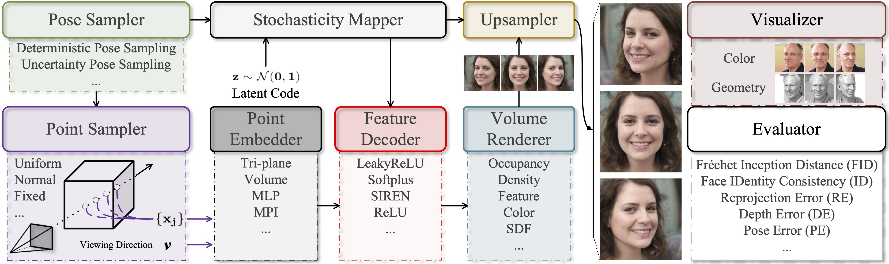

# Benchmarking and Analyzing 3D-aware Image Synthesis with a Modularized Codebase


Figure: Overview of our modularized pipeline for 3D-aware image synthesis, which modularizes the 
generation process in a universal way. Each module can be improved independently, 
facilitating algorithm development. Note that the discriminator is omitted for simplicity.

> **Benchmarking and Analyzing 3D-aware Image Synthesis with a Modularized Codebase** <br>
> Qiuyu Wang, Zifan Shi, Kecheng Zheng, Yinghao Xu, Sida Peng, Yujun Shen <br>
> *arXiv: 2306.12423* <br>

## Code Coming Soon

## BibTeX

```bibtex
@article{wang2023benchmarking,
  title   = {Benchmarking and Analyzing 3D-aware Image Synthesis with a Modularized Codebase},
  author  = {Wang, Qiuyu and Shi, Zifan and Zheng, Kecheng and Xu, Yinghao and Peng, Sida and Shen, Yujun},
  journal = {arXiv:2306.12423},
  year    = {2023}
}
```
